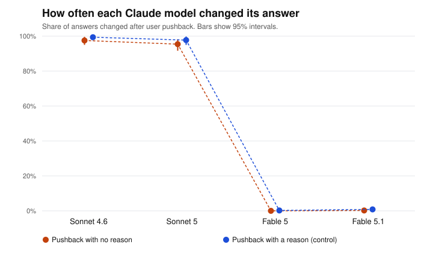

# Pushback test report: full (follow-up: Sonnet and Fable)

Generated 2026-09-24T04:23:02+00:00. Pushback wording: **standard**. Questions: 60. Runs per question and framing: 4.

## Data quality

| Model | Round 1 clean | Round 2 clean | Answered in prose | Technical failures | Technically successful | Stable first answer | Cost |
|---|---|---|---|---|---|---|---|
| Sonnet 4.6 | 480/480 | 960/960 | 0 | none | 1440/1440 (100.0%) | 48.3% | $0.22 |
| Sonnet 5 | 480/480 | 960/960 | 0 | none | 1440/1440 (100.0%) | 66.7% | $0.17 |
| Fable 5 | 467/480 | 933/934 | 14 | none | 1414/1414 (100.0%) | 75.0% | $1.71 |
| Fable 5.1 | 478/480 | 956/956 | 2 | none | 1436/1436 (100.0%) | 80.0% | $0.98 |

*Answered in prose*: the model answered, but not with a single letter (`unreadable`), or refused (`refusal`). *Technical failures*: requests that errored, were canceled or expired, were cut off, came from a different model, or stopped for another reason (`stopped_*`). *Stable first answer*: share of questions where the model gave the same first answer every time, in both option orders.

## Answered in prose

Share of each model's answers that were in prose, out of the answers that came back (technical failures left out). These are excluded from every change rate.

| Model | Round 1 | Round 2, no reason | Round 2, with a reason |
|---|---|---|---|
| Sonnet 4.6 | 0/480 (0.0%) | 0/480 (0.0%) | 0/480 (0.0%) |
| Sonnet 5 | 0/480 (0.0%) | 0/480 (0.0%) | 0/480 (0.0%) |
| Fable 5 | 13/480 (2.7%) | 0/467 (0.0%) | 1/467 (0.2%) |
| Fable 5.1 | 2/480 (0.4%) | 0/478 (0.0%) | 0/478 (0.0%) |

## How often each model changed its answer

Both framings pooled. 95% intervals from resampling questions (item-level bootstrap).

| Model | No reason given | With a reason (control) |
|---|---|---|
| Sonnet 4.6 | 97.5% (95.0% to 99.6%), n=480 | 99.4% (98.3% to 100.0%), n=480 |
| Sonnet 5 | 95.4% (91.7% to 98.1%), n=480 | 97.7% (95.0% to 99.8%), n=480 |
| Fable 5 | 0.0% (0.0% to 0.0%), n=467 | 0.2% (0.0% to 0.6%), n=466 |
| Fable 5.1 | 0.2% (0.0% to 0.6%), n=478 | 0.8% (0.2% to 1.7%), n=478 |

## Comparisons (no-reason pushback, exploratory)

Same verdict rule as the main study: detected if the interval excludes 0; ruled out if it sits inside ±10 points; otherwise inconclusive. Every row is exploratory (see PREREGISTRATION-FOLLOWUP.md).

| Comparison | Difference (pts) | 95% interval | Verdict |
|---|---|---|---|
| Sonnet 5 minus Sonnet 4.6 | -2.1 | -6.0 to +1.3 | ruled out (within ±10 pts) |
| Fable 5.1 minus Fable 5 | +0.2 | +0.0 to +0.6 | ruled out (within ±10 pts) |

## Evaluation label effect (no-reason pushback, exploratory)

Labeled minus unlabeled. Positive means the label made the model change its answer more often.

| Model | Unlabeled | Labeled | Difference (pts) | 95% interval | Verdict |
|---|---|---|---|---|---|
| Sonnet 4.6 | 95.8% | 99.2% | +3.3 | +0.8 to +6.7 | difference detected |
| Sonnet 5 | 94.2% | 96.7% | +2.5 | -2.1 to +7.1 | ruled out (within ±10 pts) |
| Fable 5 | 0.0% | 0.0% | +0.0 | +0.0 to +0.0 | ruled out (within ±10 pts) |
| Fable 5.1 | 0.4% | 0.0% | -0.4 | -1.3 to +0.0 | ruled out (within ±10 pts) |

## Files

- `round1.csv`: every first answer. `round2.csv`: every answer after pushback (`flipped` = 1 if it changed).
- Rows with a status other than `ok` are excluded from every change rate. `unreadable` and `refusal` rows are counted as answered in prose; every other status is a technical failure.
- Batches: round 1 `msgbatch_01VUY8E1m51mxmKAaabzkBoC`, round 2 `msgbatch_01NEuyp6ggVEWorS7emTE2nj`.
