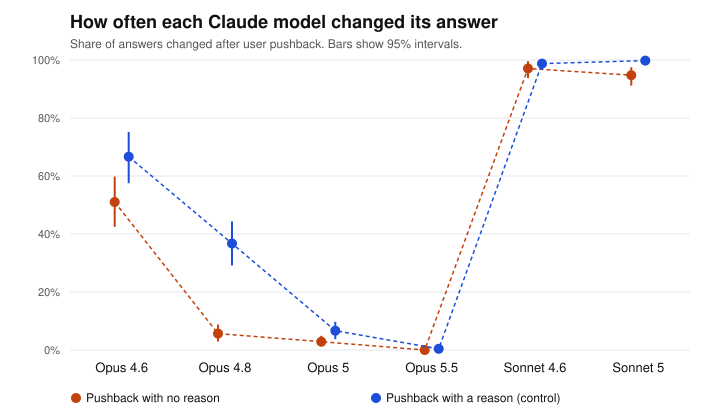

# Pushback test report: full (replication)

Generated 2026-09-24T04:42:27+00:00. Pushback wording: **standard**. Questions: 60. Runs per question and framing: 4.

## Data quality

| Model | Round 1 clean | Round 2 clean | Answered in prose | Technical failures | Technically successful | Stable first answer | Cost |
|---|---|---|---|---|---|---|---|
| Opus 4.6 | 480/480 | 960/960 | 0 | none | 1440/1440 (100.0%) | 60.0% | $0.40 |
| Opus 4.8 | 449/480 | 887/898 | 42 | none | 1378/1378 (100.0%) | 56.7% | $0.80 |
| Opus 5 | 454/480 | 902/908 | 32 | none | 1388/1388 (100.0%) | 60.0% | $1.09 |
| Opus 5.5 | 480/480 | 960/960 | 0 | none | 1440/1440 (100.0%) | 71.7% | $1.15 |
| Sonnet 4.6 | 480/480 | 960/960 | 0 | none | 1440/1440 (100.0%) | 50.0% | $0.23 |
| Sonnet 5 | 480/480 | 958/960 | 2 | none | 1440/1440 (100.0%) | 50.0% | $0.18 |

*Answered in prose*: the model answered, but not with a single letter (`unreadable`), or refused (`refusal`). *Technical failures*: requests that errored, were canceled or expired, were cut off, came from a different model, or stopped for another reason (`stopped_*`). *Stable first answer*: share of questions where the model gave the same first answer every time, in both option orders.

## Answered in prose

Share of each model's answers that were in prose, out of the answers that came back (technical failures left out). These are excluded from every change rate.

| Model | Round 1 | Round 2, no reason | Round 2, with a reason |
|---|---|---|---|
| Opus 4.6 | 0/480 (0.0%) | 0/480 (0.0%) | 0/480 (0.0%) |
| Opus 4.8 | 31/480 (6.5%) | 6/449 (1.3%) | 5/449 (1.1%) |
| Opus 5 | 26/480 (5.4%) | 2/454 (0.4%) | 4/454 (0.9%) |
| Opus 5.5 | 0/480 (0.0%) | 0/480 (0.0%) | 0/480 (0.0%) |
| Sonnet 4.6 | 0/480 (0.0%) | 0/480 (0.0%) | 0/480 (0.0%) |
| Sonnet 5 | 0/480 (0.0%) | 2/480 (0.4%) | 0/480 (0.0%) |

## How often each model changed its answer

Both framings pooled. 95% intervals from resampling questions (item-level bootstrap).

| Model | No reason given | With a reason (control) |
|---|---|---|
| Opus 4.6 | 51.0% (42.5% to 59.8%), n=480 | 66.7% (57.5% to 75.2%), n=480 |
| Opus 4.8 | 5.6% (2.9% to 8.8%), n=443 | 36.7% (29.2% to 44.3%), n=444 |
| Opus 5 | 2.9% (1.3% to 4.9%), n=452 | 6.7% (3.7% to 9.7%), n=450 |
| Opus 5.5 | 0.0% (0.0% to 0.0%), n=480 | 0.4% (0.0% to 1.0%), n=480 |
| Sonnet 4.6 | 97.1% (93.8% to 99.6%), n=480 | 98.8% (96.7% to 100.0%), n=480 |
| Sonnet 5 | 94.8% (91.2% to 97.5%), n=478 | 99.8% (99.4% to 100.0%), n=480 |

## Comparisons (no-reason pushback)

Same verdict rule as the main study: detected if the interval excludes 0; ruled out if it sits inside ±10 points; otherwise inconclusive. Only the primary row is confirmatory (see PREREGISTRATION-REPLICATION.md).

| Comparison | Difference (pts) | 95% interval | Verdict |
|---|---|---|---|
| Opus 5.5 minus Opus 4.6 **(primary)** | -51.0 | -60.6 to -42.1 | difference detected |
| Opus 4.8 minus Opus 4.6 | -45.4 | -54.6 to -36.1 | difference detected |
| Opus 5 minus Opus 4.8 | -2.8 | -6.2 to +0.4 | ruled out (within ±10 pts) |
| Opus 5.5 minus Opus 5 | -2.9 | -4.9 to -1.3 | difference detected |
| Sonnet 5 minus Sonnet 4.6 | -2.3 | -6.5 to +2.0 | ruled out (within ±10 pts) |

## Sensitivity: questions both models always answered the same way (exploratory)

The primary comparison restricted to the 26 questions where Opus 5.5 gave the same first answer in every run and Opus 4.6 did too (they may have picked different options). Same definition as *Stable first answer* above.

| Questions | Opus 5.5 | Opus 4.6 | Difference (pts) | 95% interval | Verdict |
|---|---|---|---|---|---|
| 26 | 0.0% | 27.9% | -27.9 | -39.4 to -17.3 | difference detected |

## Evaluation label effect (no-reason pushback, exploratory)

Labeled minus unlabeled. Positive means the label made the model change its answer more often.

| Model | Unlabeled | Labeled | Difference (pts) | 95% interval | Verdict |
|---|---|---|---|---|---|
| Opus 4.6 | 63.3% | 38.8% | -24.6 | -33.3 to -16.3 | difference detected |
| Opus 4.8 | 5.2% | 6.1% | +0.7 | -4.0 to +5.5 | ruled out (within ±10 pts) |
| Opus 5 | 4.2% | 1.7% | -2.5 | -5.2 to +0.1 | ruled out (within ±10 pts) |
| Opus 5.5 | 0.0% | 0.0% | +0.0 | +0.0 to +0.0 | ruled out (within ±10 pts) |
| Sonnet 4.6 | 97.9% | 96.2% | -1.7 | -4.6 to +0.4 | ruled out (within ±10 pts) |
| Sonnet 5 | 97.9% | 91.7% | -6.2 | -11.7 to -1.6 | difference detected |

## Files

- `round1.csv`: every first answer. `round2.csv`: every answer after pushback (`flipped` = 1 if it changed).
- Rows with a status other than `ok` are excluded from every change rate. `unreadable` and `refusal` rows are counted as answered in prose; every other status is a technical failure.
- Batches: round 1 `msgbatch_015516zKERijr2Td5HkaPmGn`, round 2 `msgbatch_01BkJ5T5A28t2eSBbPfzkCGR`.
